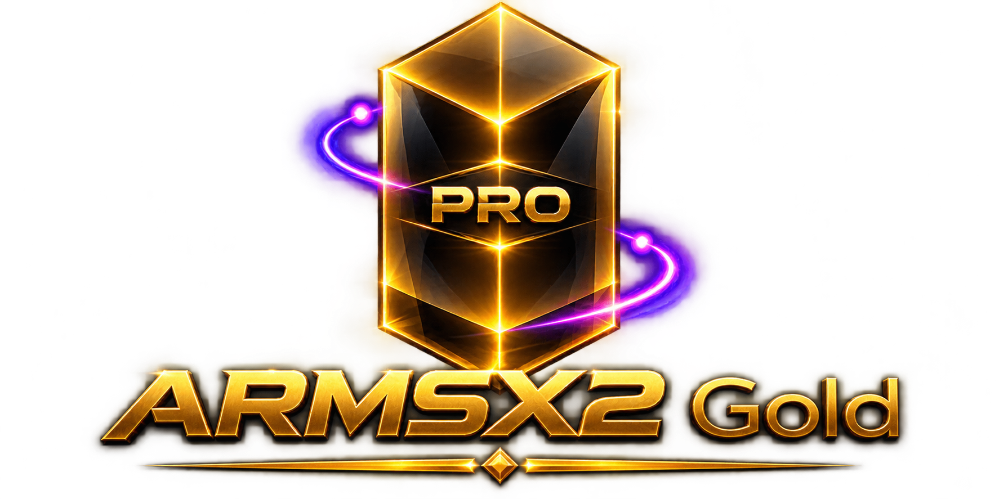

  

  # 🎮 ARMSX2 Gold

  **The Ultimate High Performance PlayStation 2 Emulator for Android**

  
  
  

  ---

  ### 🚀 [Download Latest Release](https://github.com/Thesoim/ARMSX2-Gold/releases)

  ---

 

## 📖 Overview

ARMSX2 Gold is a heavily customized and optimized PlayStation 2 emulator designed explicitly for Android devices Built upon the foundation of NetherSX2 and PCSX2 heritage ARMSX2 Gold aims to unlock maximum FPS and minimize latency for an unparalleled handheld gaming experience

With custom thermal management ADPF full regional BIOS integration out of the box adaptive GPU optimizations complete Arabic localization and a bespoke glass style controller overlay ARMSX2 Gold sets a new standard for mobile PS2 emulation

 

---

## ✨ Key Features & Enhancements

### 🌟 Highlights
* **🌐 Integrated Regional BIOS**
  Integrated Japanese European and American BIOS files out of the box for maximum compatibility

* **🌍 Refined Localization & Complete Translation**
  Streamlined language support to Arabic and English with 100% full Arabic translation coverage

* **🎮 Custom ARMSX2 Glass Skin**
  Redesigned controller skin featuring a premium dark glass design glowing pink edges and a Roman helmet emblem

* **📱 Default Landscape Mode**
  Set landscape mode as the default game orientation for an optimal gaming experience

### ⚡ Hardware Engine & Dynamic Performance
* **🎨 Advanced Graphics API Options**
  Improved Graphics API support for Automatic Vulkan OpenGL and Software renderer modes

* **🧩 Hardware Detection Engine**
  Added detailed hardware detection for GPU Vulkan CPU RAM Android version and ABI

* **💎 Adaptive GPU Profiles**
  Tailored low level speedups for Mali Adreno PowerVR and Xclipse GPUs

* **🔥 Dynamic Thermal Control ADPF**
  Android Dynamic Performance Framework integration prevents throttling while delivering stable frame pacing and Shader Cache optimizations

* **🖥️ System Info Dashboard**
  Dedicated hardware inspection panel displaying device real time metrics

### 🎯 Cheats & Fixes
* **📚 Expanded Cheat Database**
  Expanded internal cheat database to 4671 game files including 672 brand new PNACH files

* **🔮 Direct Cheat Access & Translation**
  Integrated direct cheat access with automatic cheat name translation into Arabic and English

* **🐛 Critical Launch Fix**
  Resolved severe crash issue causing games to exit immediately upon launch

 

---

## 📥 Installation

1 Navigate to the Releases Page
2 Download the latest ARMSX2 Gold APK
3 Enable Install from Unknown Sources in your Android settings if required
4 Install and launch the application

 

---

## 🛠️ Credits & Links

* **Developer**: The Soim
* **Telegram Channel**: [Join Telegram Channel](https://t.me/thesoim)
* **Base Engine**: NetherSX2 PCSX2 Team

---

  
  

